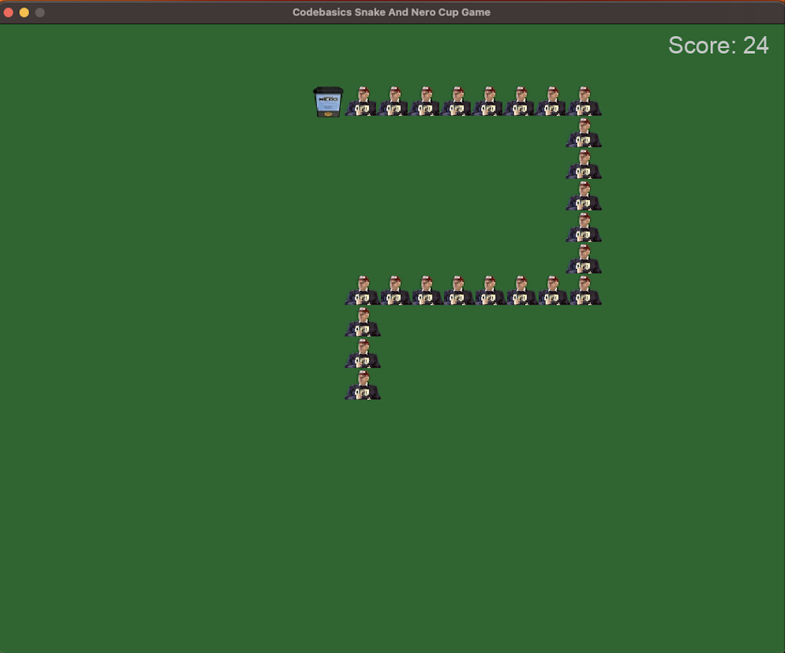

# NR320_PythonSnakeGame


## 📖 Project Overview

**NR320 Snake Game** is an engaging and interactive experience that embodies the vibrant Nero coffee culture at Özyeğin University. Guide Hüsnü Özyeğin as he navigates through challenges to reach his beloved Nero coffees. Join us in this unique adventure and become a part of our university's culture!

## 🎮 About the Game

- **Objective**: Help Hüsnü Özyeğin collect coffee cups to grow the snake and achieve the highest score.
- **Controls**: 
  - **Up**: [↑]
  - **Down**: [↓]
  - **Left**: [←]
  - **Right**: [→]
- **Rules**: The snake must not collide with itself or the boundaries of the screen. Avoid crashing to keep your game going!

### 📸 Gameplay Screenshots



## 🚀 Getting Started

### Requirements

- Python 3.12
- Pygame Library

### Installation

1. Clone the repository:
   ```bash
   git clone https://github.com/CagataySavasli/NR320_PythonSnakeGame.git
   
2. Change directory to the cloned repository:
    ```bash
   cd NR320_PythonSnakeGame
3. Install the required libraries:
    ```bash
    pip install pygame
4. Start the game:
    ```bash
    python main.py
